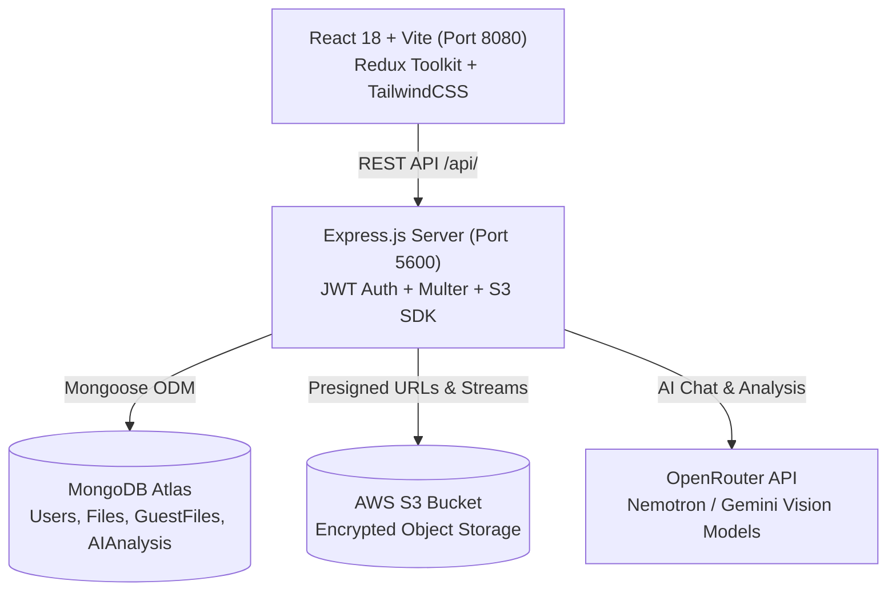

<div align="center">

# 🔐 ShareVault

### Next-Generation Secure File Sharing & Document Intelligence Platform

ShareVault is a production-ready, full-stack file sharing ecosystem built with **React 18**, **Express.js**, **MongoDB**, **AWS S3**, and **OpenRouter AI**. It offers frictionless guest sharing, password-protected encrypted transfers, automated link expiry, inline media previewing, and an integrated AI Assistant that analyzes documents, detects sensitive PII, and answers questions from uploaded files.

**Crafted with ❤️ by [Shivam Rai](https://techwithshivam.in/)**

[](https://react.dev/)
[](https://vitejs.dev/)
[](https://tailwindcss.com/)
[](https://nodejs.org/)
[](https://www.mongodb.com/)
[](https://aws.amazon.com/s3/)
[](https://openrouter.ai/)

</div>

---

## 📑 Table of Contents

- [Key Features](#-key-features)
- [Architecture & Tech Stack](#-architecture--tech-stack)
- [Project Directory Structure](#-project-directory-structure)
- [Getting Started](#-getting-started)
  - [Prerequisites](#prerequisites)
  - [1. Clone and Install](#1-clone-and-install)
  - [2. Environment Configuration](#2-environment-configuration)
  - [3. Running the Project](#3-running-the-project)
  - [4. Production Build](#4-production-build)
- [AI Intelligence Suite](#-ai-intelligence-suite)
- [API Reference](#-api-reference)
  - [Authentication Routes](#1-authentication-routes-apiusers)
  - [File Management Routes](#2-file-management-routes-apifiles)
  - [AI Intelligence Routes](#3-ai-intelligence-routes-apiai)
- [Security & Best Practices](#-security--best-practices)
- [Troubleshooting & FAQs](#-troubleshooting--faqs)
- [License](#-license)

---

## ✨ Key Features

### 🚀 Core File Sharing
- **Multi-File Drag & Drop**: Real-time file upload with progress tracking and automatic file type classification.
- **Password-Protected Transfers**: Protect sensitive files with bcrypt-hashed passwords.
- **Custom Expiry Controls**: Set automatic file expiration (hours or dates) with automatic status management.
- **Short URLs & QR Codes**: Instantly generate clean shareable short links and downloadable QR codes for mobile scanning.
- **Guest Sharing Mode**: Full guest support allowing users to upload and share files instantly without signing up.
- **Comprehensive User Dashboard**: Real-time storage stats, total upload/download counters, file search, and activity history.

### 🖼️ Rich Media Previews
- **Presigned Inline Media Viewer**: Securely stream and preview files directly from AWS S3 without public bucket exposure.
- **High-Resolution Images**: In-browser lightbox zoom (0.5x to 4x) and fullscreen mode.
- **Interactive PDF Viewer**: Embedded PDF rendering with page navigation.
- **Audio & Video Playback**: Built-in HTML5 player supporting MP4, MOV, MKV, MP3, WAV, and more.
- **Syntax-Highlighted Text Viewer**: In-browser preview for code, markdown, JSON, and plain text files.

### 🤖 AI Document Intelligence & Assistant
- **AI Document Summary**: Instant extraction of document summaries, document classification, and keyword tagging.
- **Security & PII Heuristic Scan**: Automated scanning for API keys, email addresses, phone numbers, passwords, and private credentials.
- **Grounded Q&A**: Ask questions about any PDF, DOCX, or text file with grounded context-aware AI answers.
- **Interactive Vault Assistant**: Dashboard floating chatbot capable of processing text queries and analyzing multi-format attachments (PDFs, images, documents).
- **Public Assistant**: Landing page virtual assistant answering visitor questions in real time.

---

## 🏗 Architecture & Tech Stack



### Frontend (`client/`)
- **Framework**: React 18, Vite 5.3
- **State Management**: Redux Toolkit (`@reduxjs/toolkit`, `react-redux`)
- **Styling**: TailwindCSS 3.4, Vanilla CSS Design System with Midnight Indigo & Aurora Glassmorphism
- **Routing**: React Router v6
- **Markdown & Icons**: `react-markdown`, `react-icons`, `react-toastify`

### Backend (`server/`)
- **Runtime & Server**: Node.js, Express.js
- **Database**: MongoDB with Mongoose ODM
- **Cloud Storage**: AWS S3 SDK (`@aws-sdk/client-s3`, `@aws-sdk/s3-request-presigner`, `aws-sdk`)
- **AI Engine**: OpenRouter API (`nvidia/nemotron-3-nano-30b-a3b:free`, `nvidia/nemotron-nano-12b-v2-vl:free`)
- **Authentication**: JSON Web Tokens (`jsonwebtoken`), `bcryptjs`
- **Text & PDF Parsing**: `pdf-parse`, `mammoth` (DOCX), `shortid`, `qrcode`, `nodemailer`

---

## 📁 Project Directory Structure

```
sharevault/
├── client/                              # React Single Page Application
│   ├── src/
│   │   ├── components/
│   │   │   ├── Auth/                    # Route Guards (RequireAuth, NotRequireAuth)
│   │   │   ├── Dashboard/               # Authenticated Dashboard
│   │   │   │   ├── FileUpload/          # Drag & Drop File Upload Page
│   │   │   │   ├── AIAnalysisModal.jsx  # AI Summary, Security & Q&A Modal
│   │   │   │   ├── VaultAssistant.jsx   # Interactive AI Assistant Widget
│   │   │   │   ├── FileShow.jsx         # User File Table & Actions
│   │   │   │   ├── ActivityFeed.jsx     # User Upload & Download Logs
│   │   │   │   └── Settings.jsx         # App Settings & Preferences
│   │   │   ├── Guest/                   # Guest Flow Components
│   │   │   │   ├── Download/            # Guest Download & Media Viewer
│   │   │   │   ├── GuestFileUpload.jsx  # Guest File Upload Box
│   │   │   │   └── PublicAssistant.jsx  # Landing Page Chatbot
│   │   │   ├── AIIcon.jsx               # Glowing AI Starburst Vector Icon
│   │   │   ├── Logo.jsx                 # ShareVault Animated Brand Logo
│   │   │   ├── DownloadPage.jsx         # Authenticated Download & Preview View
│   │   │   ├── Login.jsx & Signup.jsx   # Authentication Views
│   │   │   └── HeaderComp.jsx / Footer  # Navigation & Footer Components
│   │   ├── redux/                       # Redux Slices (auth, file, ai)
│   │   ├── config/axiosInstance.js      # Centralized Axios Interceptor
│   │   ├── index.css                    # Midnight Indigo Theme & Tokens
│   │   └── toast.css                    # Custom Animated Toast Theme
│   ├── vite.config.js                   # Vite Dev Server with /api Proxy
│   └── package.json
│
├── server/                              # Express REST API Server
│   ├── src/
│   │   ├── controllers/
│   │   │   ├── ai.controller.js         # AI Chat, Document Analysis & Grounded Q&A
│   │   │   ├── file.controller.js       # File Upload, S3 Presigning, Expiry & Verification
│   │   │   └── user.controller.js       # Auth, Registration, Login & Profile
│   │   ├── models/
│   │   │   ├── aiAnalysis.models.js     # AI Analysis Cache Schema
│   │   │   ├── file.models.js           # User Files Schema
│   │   │   ├── guestFile.models.js      # Guest Files Schema
│   │   │   └── user.models.js           # User Account Schema
│   │   ├── middlewares/
│   │   │   ├── auth.middlewares.js      # JWT Token Verification & Protection
│   │   │   └── upload.middlewares.js    # Multer In-Memory Storage
│   │   ├── routes/
│   │   │   ├── ai.routes.js             # /api/ai Routes
│   │   │   ├── file.routes.js           # /api/files Routes
│   │   │   └── user.routes.js           # /api/users Routes
│   │   ├── services/
│   │   │   └── aiService.js             # OpenRouter Client & Document Parser
│   │   ├── config/                      # AWS S3 & MongoDB Connections
│   │   └── index.js                     # Express Entry Point & Middleware
│   ├── .env                             # Server Environment Variables
│   └── package.json
│
├── package.json                         # Monorepo Scripts
└── README.md                            # Documentation
```

---

## 🚀 Getting Started

### Prerequisites
- **Node.js**: v18.0.0 or higher
- **MongoDB**: Local instance or MongoDB Atlas URI
- **AWS S3**: An active S3 bucket with access credentials
- **OpenRouter API Key**: Free key from [openrouter.ai](https://openrouter.ai/)

---

### 1. Clone and Install

Clone the repository and install dependencies for both `client` and `server`:

```bash
git clone https://github.com/shivamrai24/sharevault.git
cd sharevault
npm install
```

---

### 2. Environment Configuration

Create a `.env` file in the `server/` directory:

```env
# ==========================================
# Server Configuration
# ==========================================
PORT=5600
NODE_ENV=development
CLIENT_URL=http://localhost:8080

# ==========================================
# Database & Auth
# ==========================================
MONGODB_URI=mongodb+srv://<username>:<password>@cluster.mongodb.net/sharevault?retryWrites=true&w=majority
JWT_SECRET=your_super_secret_jwt_key_here

# ==========================================
# AWS S3 Storage
# ==========================================
AWS_ACCESS_KEY_ID=your_aws_access_key_id
AWS_SECRET_ACCESS_KEY=your_aws_secret_access_key
AWS_REGION=ap-south-1
AWS_BUCKET_NAME=your_s3_bucket_name

# ==========================================
# OpenRouter AI Configuration
# ==========================================
OPENROUTER_API_KEY=sk-or-v1-your_openrouter_api_key_here
OPENROUTER_MODEL=nvidia/nemotron-3-nano-30b-a3b:free
OPENROUTER_VISION_MODEL=nvidia/nemotron-nano-12b-v2-vl:free
```

*(Optional)* In `client/`, verify `vite.config.js` proxies `/api` to `http://localhost:5600`.

---

### 3. Running the Project

You can run both client and server concurrently using the root script:

```bash
# Run both Frontend and Backend concurrently
npm run dev:all
```

Or start them individually in separate terminals:

```bash
# Terminal 1 — Backend API
cd server
npm start

# Terminal 2 — Frontend Dev Server
cd client
npm run dev
```

- **Frontend Application**: `http://localhost:8080`
- **Backend API Server**: `http://localhost:5600`

---

### 4. Production Build

To compile the React frontend into production-ready static assets:

```bash
npm run build
```

The output bundle will be created in `client/dist/` ready to be served by Express or any static hosting service.

---

## 🤖 AI Intelligence Suite

ShareVault integrates an intelligent AI pipeline powered by OpenRouter:

```
                  ┌──────────────────────────────┐
                  │   Uploaded Document (.pdf)   │
                  └──────────────┬───────────────┘
                                 │
                     [Text & Buffer Extractor]
                                 │
                 ┌───────────────┴───────────────┐
                 ▼                               ▼
       [OpenRouter LLM Pipeline]        [Heuristic Security Scan]
                 │                               │
        ┌────────┴────────┐             ┌────────┴────────┐
        ▼                 ▼             ▼                 ▼
   Document Summary   Key Topics   Risk Assessment   Sensitive PII
```

### Features Breakdown
1. **Automated Document Categorization**: Analyzes document semantics and tags as `Academic`, `Code`, `Legal`, `Invoice`, `Image`, or `Other`.
2. **PII & Credential Detection**: Scans for compromised credentials, private tokens, API keys, emails, and phone numbers.
3. **Grounded Q&A**: Employs context-bounded querying so that answers are derived strictly from the document without hallucination.
4. **Vault Assistant with Vision Support**: Supports image attachments (screenshots, diagrams) and text documents for multi-modal conversational help.

---

## 🔌 API Reference

### 1. Authentication Routes (`/api/users`)

| Method | Endpoint | Description | Auth Required |
| :--- | :--- | :--- | :--- |
| `POST` | `/register` | Create a new user account | No |
| `POST` | `/login` | Authenticate user and receive JWT | No |
| `GET` | `/user/:userId` | Fetch user profile details | Yes (JWT) |

---

### 2. File Management Routes (`/api/files`)

| Method | Endpoint | Description | Auth Required |
| :--- | :--- | :--- | :--- |
| `POST` | `/upload` | Upload multiple files for authenticated user | Yes (JWT) |
| `POST` | `/upload-guest` | Upload files as a guest user | No |
| `GET` | `/getUserFiles/:userId` | Get all files uploaded by user | Yes (JWT) |
| `GET` | `/f/:shortCode` | Resolve short link & generate presigned download/preview URL | No |
| `GET` | `/g/:shortCode` | Resolve guest short link & generate presigned URLs | No |
| `POST` | `/verifyFilePassword` | Verify password for protected user file | No |
| `POST` | `/verifyGuestFilePassword` | Verify password for protected guest file | No |
| `DELETE` | `/delete/:fileId` | Permanently delete a file from database and S3 | Yes (JWT) |
| `GET` | `/generateQR/:fileId` | Generate dynamic QR code image for file URL | No |
| `POST` | `/updateFileExpiry` | Update expiry time for a specific file | Yes (JWT) |
| `POST` | `/updateFilePassword` | Update or remove password protection | Yes (JWT) |

---

### 3. AI Intelligence Routes (`/api/ai`)

| Method | Endpoint | Description | Auth Required |
| :--- | :--- | :--- | :--- |
| `POST` | `/public-chat` | General AI assistant chat for landing page | No |
| `POST` | `/chat` | Dashboard Vault Assistant chat conversation | Yes (JWT) |
| `POST` | `/chat-attachment` | Multi-modal chat with image or document attachment | Yes (JWT) |
| `POST` | `/analyze/:fileId` | Run full AI analysis on document | Yes (JWT) |
| `GET` | `/analysis/:fileId` | Retrieve cached AI analysis result | Yes (JWT) |
| `POST` | `/ask/:fileId` | Grounded question answering on specific file | Yes (JWT) |

---

## 🔒 Security & Best Practices

- **Zero Public S3 Exposure**: All files stored in AWS S3 remain private. Access is mediated exclusively through time-limited AWS Presigned URLs (configured with `inline` for browser rendering and `attachment` for downloads).
- **Cryptographic Password Hashing**: Passwords for locked files and user accounts are hashed using `bcryptjs` with salt rounds.
- **Stateless JWT Authentication**: Secure, token-based authentication verified via middleware with automatic token expiry handling.
- **Sanitized Upload Buffers**: Multer in-memory streaming ensures files are processed and uploaded to S3 without orphaned temporary files on the server disk.

---

## 🛠 Troubleshooting & FAQs

#### Q: The AI Assistant returns "Trouble connecting" or 400 errors.
> **Fix**: Verify your `OPENROUTER_API_KEY` in `server/.env`. Make sure your key has active credits or is using the free tier models (`nvidia/nemotron-3-nano-30b-a3b:free` or `nvidia/nemotron-nano-12b-v2-vl:free`).

#### Q: File previews or downloads show "Failed to fetch".
> **Fix**: Ensure your backend server is running on port `5600`. The Vite dev server proxies all `/api` traffic directly to `http://localhost:5600`.

#### Q: Upload fails when setting a password or expiry date.
> **Fix**: Ensure the expiry date selected is in the future. The server automatically validates and parses numeric hour offsets as well as ISO date formats safely.

---

## 📜 License

Distributed under the **MIT License**.

```
Copyright (c) 2026 Shivam Rai

Permission is hereby granted, free of charge, to any person obtaining a copy
of this software and associated documentation files (the "Software"), to deal
in the Software without restriction...
```

---

<div align="center">
<sub>Designed & Developed with precision by <a href="https://techwithshivam.in/"><b>Shivam Rai</b></a></sub>
</div>
